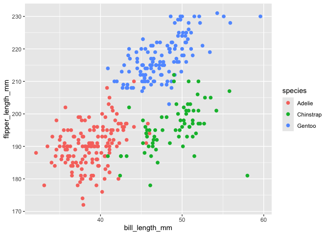

P8105 HW 1
================

``` r
library(tidyverse)
```

    ## ── Attaching core tidyverse packages ──────────────────────── tidyverse 2.0.0 ──
    ## ✔ dplyr     1.1.4     ✔ readr     2.1.5
    ## ✔ forcats   1.0.0     ✔ stringr   1.5.1
    ## ✔ ggplot2   3.5.1     ✔ tibble    3.2.1
    ## ✔ lubridate 1.9.3     ✔ tidyr     1.3.1
    ## ✔ purrr     1.0.2     
    ## ── Conflicts ────────────────────────────────────────── tidyverse_conflicts() ──
    ## ✖ dplyr::filter() masks stats::filter()
    ## ✖ dplyr::lag()    masks stats::lag()
    ## ℹ Use the conflicted package (<http://conflicted.r-lib.org/>) to force all conflicts to become errors

``` r
library(palmerpenguins)
library(ggplot2)
library(tibble)
```

## Problem 1

This data has the following variables listed: species, island, bill
length (mm), bill depth (mm), flipper length (mm), body mass (g), sex,
and year. This particular dataset has 8 columns and 344 rows.

``` r
mean(penguins[["flipper_length_mm"]], na.rm = TRUE)
```

    ## [1] 200.9152

Here is the scatterplot of flipper_length_mm (y) vs, bill_length_mm (x).

``` r
ggplot(penguins, aes(x = bill_length_mm, y = flipper_length_mm, color = species)) + geom_point(size = 2)
```

    ## Warning: Removed 2 rows containing missing values or values outside the scale range
    ## (`geom_point()`).

<!-- -->

``` r
ggsave("flipper_length_mm vs. bill_length_mm.png")
```

    ## Saving 7 x 5 in image

    ## Warning: Removed 2 rows containing missing values or values outside the scale range
    ## (`geom_point()`).

## Problem 2

``` r
sample_df = tibble(
  random_sample = rnorm(10), 
  vec_char = c("red", "orange", "yellow", "blue", "green", "pink", "purple", "black", "white", "gray" ),
  greater_than_zero = random_sample > 0,
  vec_factor = factor(sample(c("Level 1", "Level 2", "Level 3"), 10, replace = TRUE))
)
```

``` r
print(sample_df)
```

    ## # A tibble: 10 × 4
    ##    random_sample vec_char greater_than_zero vec_factor
    ##            <dbl> <chr>    <lgl>             <fct>     
    ##  1        0.911  red      TRUE              Level 2   
    ##  2        0.0531 orange   TRUE              Level 3   
    ##  3       -1.30   yellow   FALSE             Level 3   
    ##  4       -0.549  blue     FALSE             Level 2   
    ##  5        0.122  green    TRUE              Level 2   
    ##  6        1.09   pink     TRUE              Level 3   
    ##  7        0.276  purple   TRUE              Level 3   
    ##  8        0.570  black    TRUE              Level 1   
    ##  9        1.38   white    TRUE              Level 1   
    ## 10       -0.748  gray     FALSE             Level 2
